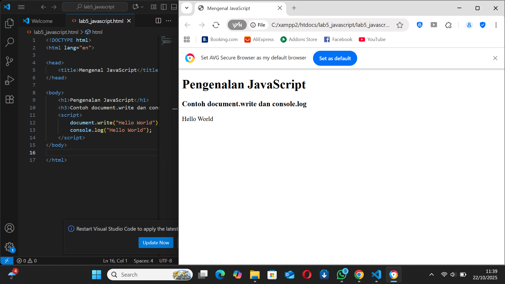
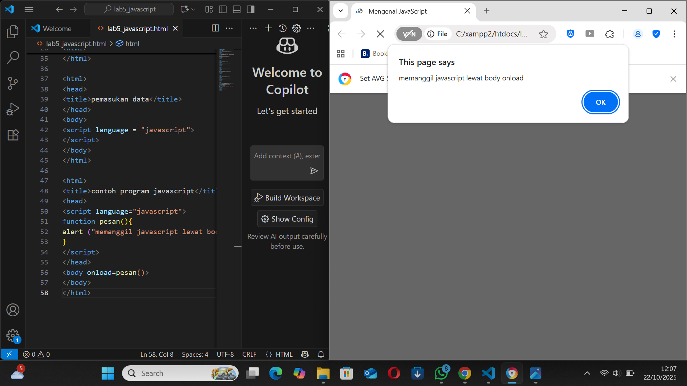
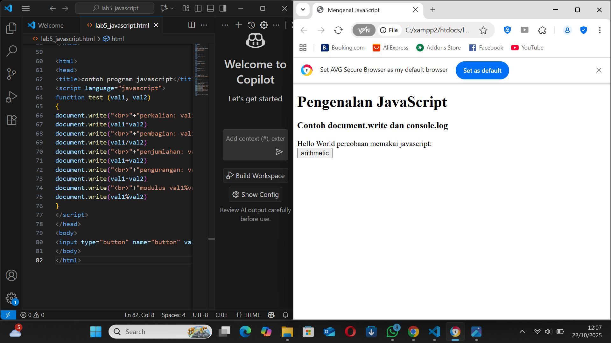
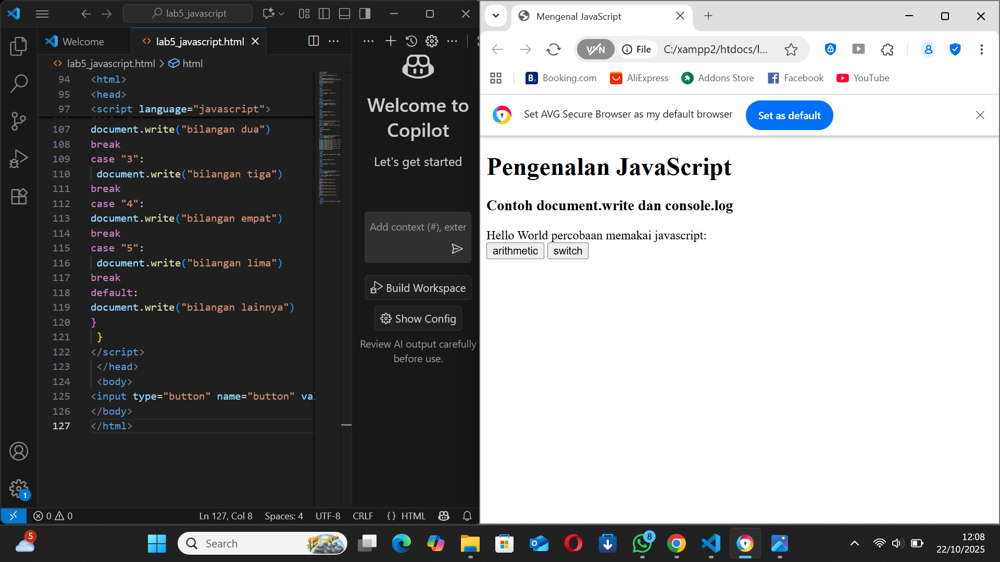
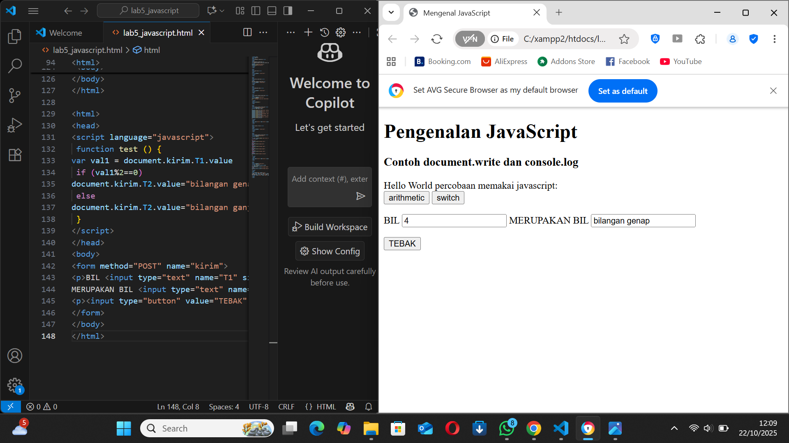
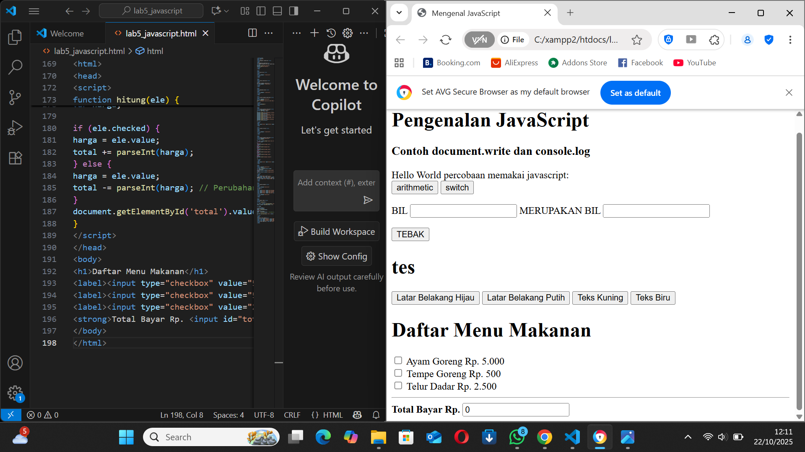

Lab5Web - Praktikum 5: JavaScript
Repository ini berisi hasil pengerjaan praktikum Pemrograman Web Modul 5: JavaScript.

Tujuan Praktikum:

Memahami sintak dasar JavaScript.

Memahami penggunaan JavaScript.

Membuat kode JavaScript sederhana.

Memanipulasi elemen HTML dengan JavaScript.

Langkah-langkah Praktikum dan Hasilnya
Berikut adalah implementasi kode dan screenshot hasil pengerjaan sesuai urutan praktikum:

1. Pengenalan Dasar: document.write dan console.log
Tujuan langkah ini adalah menampilkan teks "Hello World" di halaman web (document.write) dan di konsol browser (console.log).

Kode yang Digunakan (lab5_javascript.html):

Hasil (Screenshot): Hasil menampilkan teks "Hello World" di bawah heading.

2. Pembuatan Fungsi dan Pemanggilan dengan onload
Langkah ini menunjukkan cara memanggil fungsi JavaScript (pesan()) secara otomatis menggunakan event onload pada tag <body>. Fungsi ini akan menampilkan alert box saat halaman dimuat.

Kode yang Digunakan:

Hasil (Screenshot): Hasil berupa alert box yang muncul begitu halaman selesai dimuat.

3. Dasar Pemrograman: Operasi Dasar Aritmatika
Langkah ini mendemonstrasikan fungsi test(val1, val2) yang berisi operasi perkalian, pembagian, penjumlahan, pengurangan, dan modulus, yang dipanggil saat tombol "arithmetic" diklik .

Kode yang Digunakan: (Hanya bagian kode yang relevan dengan fungsi dan tombol)

Hasil (Screenshot): Hasil menampilkan tombol "arithmetic" di halaman. Output dari fungsi document.write (perkalian, dsb.) akan terlihat setelah tombol diklik.

4. Dasar Pemrograman: Seleksi Kondisi (switch)
Langkah ini menunjukkan penggunaan operator switch di dalam fungsi test() yang akan dipanggil saat tombol "switch" diklik. Fungsi ini akan meminta input dan menampilkan keterangan bilangan yang sesuai.

Kode yang Digunakan: (Hanya bagian kode yang relevan dengan fungsi dan tombol)

Hasil (Screenshot): Hasil menampilkan tombol "switch" di halaman.

5. Pembuatan Form: Form Input (Ganjil/Genap)
Langkah ini menggunakan form HTML dengan fungsi test() untuk memverifikasi apakah input bilangan ganjil atau genap (val1%2==0). Hasilnya akan ditampilkan di field output (T2) .

Kode yang Digunakan: (Hanya bagian kode yang relevan dengan form dan fungsi)

Hasil (Screenshot): Hasil menunjukkan form dengan input dan output yang sudah terisi ("BIL 4 MERUPAKAN BIL bilangan genap") setelah tombol "TEBAK" diklik.

6. Pembuatan Form: Form Button (Mengubah Warna Background dan Teks)
Langkah ini menggunakan tombol-tombol yang memanggil fungsi JavaScript (ubahwarnaLB dan ubahwarnaLD) untuk memanipulasi properti document.bgColor (warna latar belakang) dan document.fgColor (warna teks) .

Kode yang Digunakan: (Hanya bagian kode yang relevan dengan fungsi dan tombol)

Hasil (Screenshot): Hasil menunjukkan tombol-tombol pengubah warna di halaman.

7. HTML DOM: Checkbox dengan Perhitungan Otomatis
Langkah terakhir ini menunjukkan manipulasi DOM di mana fungsi hitung(ele) dipanggil setiap kali checkbox diubah. Fungsi ini akan menghitung total harga menu yang dipilih dan menampilkannya di field "Total Bayar".

Kode yang Digunakan: (Hanya bagian kode yang relevan dengan fungsi hitung dan elemen form)

Hasil (Screenshot): Hasil menampilkan daftar menu dengan checkbox dan field "Total Bayar".

